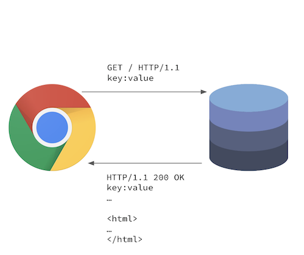

<style>
.reveal code {
  background: lightgray;
  padding: 5px;
}
</style>

# Javascript

---


## Javascript

ist eine interpretierte Sprache, die von Browsern intepretiert wird.

----

1. Chrome fragt Adresse an
2. Server liefert HTML Dokument mit Javascript zurück
3. Chrome intepretiert HTML, CSS, Javascript



----

```html
<html>
  <head>
    <script type=”text/javascript”>
      function onHello(event) {
        event.target.innerHTML = "World";
      }

      function outHello(event) {
        event.target.innerHTML = "Hello";
      }

      var element = document.getElementById("hello");
      element.addEventListener("mouseover", onHello);
      element.addEventListener("mouseleave", outHello);
    </script>
  </head>
  <body>
    <p>Hallo</p>
  </body>
</html>
```

---

## Variablen, Bedingungen und Schleifen

---

## Variablen in Javascript

----

Variablen werden mit `var` eingeleitet.

```javascript
var a = 2;
var b = 'hello world';
var c = 3.5;
var d = true;
```

---

## Bedingungen in Javascript

----

Javascript hat zwei Gleichheitsoperatoren `==` und `===` [Link](https://developer.mozilla.org/de/docs/Web/JavaScript/Vergleiche_auf_Gleichheit_und_deren_Verwendung).


- `==` prüft auf "lose Gleichheit"
- `===` prüft auf "strikte Gleichheit"


```javascript
var a = 2;
var b = '2';
if (a == b) {
  console.log('works!');
} else {
  console.log('jumps not in here');
}

if (a === b) {
  console.log('doesnt work!');
} else {
  console.log('jumps here');
}
```

----

Ansonsten gelten die allgemeinen Vergleichsoperatoren:

`>`, `<`, `<=`, `>=`

---

## Schleifen in Javascript

[Link](https://wiki.selfhtml.org/wiki/JavaScript/Schleife#Schleifen_mit_.22for.22)

----

### For-Schleife

```javascript
for (var variable = anfangswert; abbruchbedingung; inkrement) {
  ...
}
```

----

Beispiel

```javascript
var sum = 0;

for (var i = 0; i <= 100; i++) {
  sum = sum + 1;
}

console.log(sum);
```

----

### Do-While-Schleife

```javascript
var confirmed = false;

do {
  confirmed = confirm(
    'Wollen Sie diese Seite wirklich sehen?'
  );
} while(!confirmed)
```

----

### While-Schleife

```javascript
var confirmed = false;

while(!confirmed) {
  confirmed = confirm(
    'Wollen Sie diese Seite wirklich sehen?'
  );
}
```

----

Eine `Do-While-Schleife` lässt sich immer in eine `While-Schleife` übertragen.

Wie?

```javascript
var confirmed = false;

while(!confirmed) {
  confirmed = confirm(
    'Wollen Sie diese Seite wirklich sehen?'
  );
}
```

---

## Javascript Arrays

----

### Motivation

Werte gemeinsam in eine Variable speichern

statt
```javascript
var a1 = 2;
var a2 = 4;
var a3 = 6;
```

so
```javascript
var a = [2, 4, 6];
```

----

### Auf Werte zugreifen

Der Index muss eine integer Zahl sein.

```javascript
var a = [2, 4, 6];
console.log(a[0]); // 2
console.log(a[1]); // 4
console.log(a[2]); // 6
```

----

### Iterieren

```javascript
var a = [2, 4, 6];
for (var i = 0; i < a.length(); i++) {
  console.log(a[i]);
}
```

----

### Wert hinzufügen

[Link](https://wiki.selfhtml.org/wiki/JavaScript/Objekte/Array/push)

```javascript
var a = [2, 4, 6];
a.push(8);
console.log(a); // [2, 4, 6, 8]
```

----

### Wert löschen

[Link](https://wiki.selfhtml.org/wiki/JavaScript/Objekte/Array/splice)

```javascript
var a = [2, 4, 6];
a.splice(1, 1);
console.log(a); // [2, 6]
```

---

## Javascript Objects

----

### Javascript Objects (Objekte)

sind das wichtigste Konzept in Javascript.

----

### Motivation

statt
```javascript
var firstName = 'Michael';
var lastName = 'Bykovski';
var age = 25;
```

so
```javascript
var human = {
  firstName: 'Michael',
  lastName: 'Bykovski',
  age: 25,
}
```

----

### Auf Werte zugreifen

1. Mit Punkt und dem Indexnamen
2. Wie bei einem Array über den Indexnamen

```javascript
var human = {
  firstName: 'Michael',
  lastName: 'Bykovski',
  age: 25,
}

console.log(human.firstName); // Michael
console.log(human['lastName']); // Bykovski
```

----

### Werte hinzufügen

Werte hinzufügen, wie beim Zugriff.

```javascript
var human = {
  firstName: 'Michael',
  lastName: 'Bykovski',
  age: 25,
}

human['city'] = 'Wiesbaden';
human.city = 'Wiesbaden';
```

---

## Javscript Funktionen

Funktionen kapseln `Code-Anweisungen innerhalb eines Namensraum` ab.
Alle Variablen, die innerhalb der Funktion definiert wurden, werden beim `Abschluss der Funktion gelöscht`.

----

### Syntax

```javascript
function name(parameter1, parameter2, paramenterN) {
  // code to be executed
}

function name(parameter1, parameter2, paramenterN) {
  // code to be executed
  return x;
}
```

----

### Beispiel

```javascript
var human = {
  firstName: 'Michael',
  lastName: 'Bykovski',
  age: 25,
}

function fullName(humanObject) {
  var fullNameVar = humanObject.firstName + ' ' + humanObject.lastName;
  return fullNameVar;
}

console.log(fullName(human)); // Michael Bykovski
console.log(fullNameVar); // error: fullNameVar is not defined
```

----

### Weiteres Beispiel

```javascript
var human = {
  firstName: 'Michael',
  lastName: 'Bykovski',
  age: 25,
}

function setFullName(humanObject) {
  humanObject.fullName = humanObject.firstName + ' ' + humanObject.lastName;
}

console.log(setFullName(human)); // undefined
console.log(human.fullName); // Michael Bykovski
```

----

### Vereinigung und `this` keyword

```javascript
var human = {
  firstName: 'Michael',
  lastName: 'Bykovski',
  age: 25,
  fullName: function() {
    return this.firstName + ' ' + this.lastName;
  }
}

console.log(human.fullName()); // Michael Bykovski
```
---

# Das `window` object

[Link](https://wiki.selfhtml.org/wiki/JavaScript/Window)

----

Das `window` object enthält Objekte, Eigenschaften und Funktionen, die der Browser und das aktuelle Fenster (in dem das Javascript ausgeführt wird) bereitstellen.

----

Auf das `window` object kann jederzeit und überall zugegriffen werden, da es so elementar ist. Es ist "global" verfügbar.

```javascript
console.log(window.innerWidth); // 700
var result = prompt('Bitte geben Sie eine Zahl ein: ');
```

---

### Das `document` object

enthält Funktionen, mit denen sich auf DOM Elemente zugreifen, manipulieren, hinzufügen und löschen lassen.

[Link](https://wiki.selfhtml.org/wiki/JavaScript/DOM/Document/)

[DOM](https://wiki.selfhtml.org/wiki/DOM) = Document Object Model ist eine Repräsentierung aller HTML Elemente im HTML Dokument als Javascript Objekte.

----

Beispiel

```html
<p id="hello" class="hello">Der Text</p>
<p id="keinHello" class="hello">Ein weiterer Text</p>
```

```javascript
var helloElement = document.getElementById('hello');
var helloElements = document.getElementsByClassName('hello');

var helloElement = document.querySelector('.hello');
var helloElements = document.querySelectorAll('.hello');
```

----

### Das Objekt [Element](https://wiki.selfhtml.org/wiki/JavaScript/DOM/Element)

spiegelt in Javascript ein HTML-Element wieder.

```html
<p id="hello" class="hello">Der Text</p>
```

```javascript
var helloElement = document.getElementById('hello');
console.log(helloElement.classList); // DOMTokenList ["hello", value: "hello"]
```

[DOMTokenList](https://wiki.selfhtml.org/wiki/JavaScript/DOM/Element/classList)

---

### Ereignisse

----

Damit Ereignisse, wie beispielsweise ein `Klick` von Javascript verwendet werden können, müssen diese `"registriert"` werden.
Bei der Registrierung wird eine Funktion `mitgegeben`, die ausgeführt wird, wenn das Ereignis `eintrifft`.

----

[Liste aller Events](https://wiki.selfhtml.org/wiki/JavaScript/DOM/Event/%C3%9Cbersicht)

[Event Object](https://wiki.selfhtml.org/wiki/JavaScript/DOM/Event)

```html
<p id="clickme">Klick auf mich</p>
```

```javascript
var element = document.getElementById('clickme');
var onClick = function(event) {
  alert('Geklickt!');
};
element.addEventListener('click', onClick)
```

```javascript
document.getElementById('clickme').addEventListener(
  'click',
  function(event) {
    alert('Geklickt!');
  },
);
```

[Resultat](https://jsfiddle.net/05gxvcak/)
